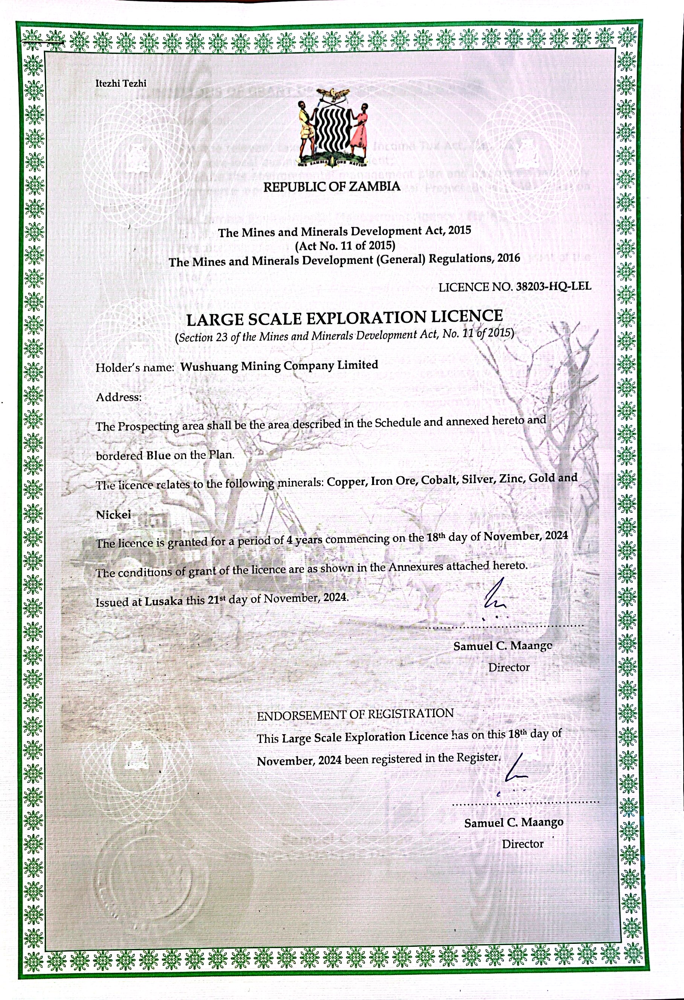

# Metallix (MTX) Technical Whitepaper

    

## Table of Contents

1. [Project Overview](#1-project-overview)
2. [Zambian Mining Background](#2-zambian-mining-background)
3. [Wushuang Mining Company Introduction](#3-wushuang-mining-company-introduction)
4. [Token Economic Model](#4-token-economic-model)
5. [Technical Implementation](#5-technical-implementation)
6. [Development Roadmap](#6-development-roadmap)
7. [Team Introduction](#7-team-introduction)
8. [Risks and Compliance](#8-risks-and-compliance)
9. [Conclusion](#9-conclusion)

## 1. Project Overview

Metallix (MTX) is an innovative blockchain project that combines Zambia's rich mineral resources with modern blockchain technology. The MTX token is issued on the Solana blockchain, providing holders with the opportunity to participate in Wushuang Mining Company's exploration outcomes, allowing investors to share in the benefits of Zambian mining development.

MTX token holders will be entitled to a share of the commercial transaction proceeds from Wushuang Mining Company's mining operations for the next three years, following the completion of the exploration report. Whether the mine is sold directly or commercially developed, the company will distribute 20% of the total revenue as dividends to token holders.

### 1.1 Project Vision

Our vision is to create a bridge connecting traditional mining with blockchain technology, enabling global investors to conveniently participate in the early stages of Zambian mining development and share in the enormous potential of African mineral resource development.

### 1.2 Project Mission

- Lower the barriers to mining investment through blockchain technology, enabling more investors to participate
- Improve transparency and traceability in the mining exploration and development process
- Inject new capital and technical support into Zambian mining development
- Create a sustainable mining investment ecosystem

## 2. Zambian Mining Background

### 2.1 Zambian Mineral Resources Overview

Zambia is a significant mineral resource country in Africa, rich in copper, cobalt, zinc, lead, and other non-ferrous metals. As an important part of the "Copperbelt," Zambia has a long mining history and is Africa's second-largest copper producer.

Major mineral resources include:
- **Copper**: Zambia has one of Africa's largest copper reserves
- **Cobalt**: Produced as a by-product of copper mining, Zambia's cobalt output is considerable
- **Iron Ore**: Distributed across multiple regions, an important industrial material
- **Zinc and Lead**: Mainly distributed in the Kabwe region
- **Gold and Silver**: Distributed across multiple regions, with high economic value
- **Nickel**: Has significant distribution in certain regions, a key material for stainless steel and battery manufacturing
- **Gemstones**: Including emeralds, amethysts, etc.

These mineral resources align closely with the minerals authorized for exploration in Wushuang Mining Company's Large Scale Exploration License (38203-HQ-LEL) - copper, iron ore, cobalt, silver, zinc, gold, and nickel - demonstrating the excellent match between the company's exploration strategy and Zambia's rich mineral resources.

### 2.2 Current State of Zambian Mining

Mining accounts for approximately 12% of Zambia's GDP and is a major source of foreign exchange earnings. In recent years, with the increasing global demand for non-ferrous metals, especially with the rapid development of electric vehicles and renewable energy industries, Zambia's mining investment value has become increasingly prominent.

The Zambian government actively promotes mining investment by providing a series of preferential policies, including tax reductions and simplified approval processes, creating a favorable investment environment for international investors.

### 2.3 Market Outlook Analysis

With the rapid development of global electric vehicles, renewable energy, and electronics markets, the demand for copper, cobalt, nickel, and other non-ferrous metals continues to grow. According to the International Copper Study Group (ICSG), global copper demand is projected to increase by approximately 50% by 2030, and Zambia, as a major copper producer, will benefit from this trend.

Additionally, the global green energy transition will drive demand for the following minerals:

- **Copper**: A core material for electric vehicles and renewable energy infrastructure, with each electric vehicle using 3-4 times more copper than traditional vehicles
- **Cobalt**: A key component in lithium batteries, with demand set to rise significantly due to the rapid development of the electric vehicle industry
- **Nickel**: An important component in battery technology, especially in high energy density batteries
- **Zinc**: Widely used in anti-corrosion applications and battery technology
- **Gold and Silver**: Beyond traditional jewelry and investment uses, these have important applications in electronics
- **Iron Ore**: As a basic raw material for steel production, demand remains stable in infrastructure construction

Wushuang Mining Company's Large Scale Exploration License (38203-HQ-LEL) specifically targets these high-demand minerals, enabling the company to fully capitalize on global market opportunities and provide a broad market space for Zambian mining development.

## 3. Wushuang Mining Company Introduction

### 3.1 Company Background

Wushuang Mining Company Limited is a mining company located in Zambia, focused on developing the region's mineral potential. The company was founded by experienced mining experts and blockchain technology specialists, aiming to combine traditional mining with modern blockchain technology to innovate the mining investment model.

In November 2024, the company successfully obtained a Large Scale Exploration License (License Number: 38203-HQ-LEL) from the Zambian government, marking an important milestone in the company's development. This license authorizes the company to explore various high-value minerals including copper, iron ore, cobalt, silver, zinc, gold, and nickel over the next 4 years, establishing a solid foundation for the company's commercial development.

### 3.2 Mining Licenses

Wushuang Mining Company has obtained a Large Scale Exploration License from the Zambian government:

- **License Number**: 38203-HQ-LEL
- **License Type**: Large Scale Exploration License (Under Section 23 of the Mines and Minerals Development Act, 2015)
- **License Holder**: Wushuang Mining Company Limited
- **Minerals for Exploration**: Copper, Iron Ore, Cobalt, Silver, Zinc, Gold, and Nickel
- **License Duration**: 4 years, effective from November 18, 2024
- **Issuance Date**: November 21, 2024 in Lusaka
- **Issued By**: Samuel C. Maango, Director
- **Registration Date**: Registered in the Register on November 18, 2024

    
    
<em>Figure 1: Large Scale Exploration License No. 38203-HQ-LEL</em>

This license authorizes the company to conduct mineral exploration activities in Zambia's Copperbelt region, laying the legal foundation for future commercial mining. The exploration area is clearly defined in the schedule attached to the license and is bordered in blue on the plan.

### 3.3 Exploration Plan

The company plans to complete the exploration funding within 12 months and complete the mine exploration within 6 months after funding. The exploration work will be executed by internationally renowned geological exploration teams using advanced exploration technologies and equipment to ensure the accuracy and reliability of the exploration results.

According to the obtained Large Scale Exploration License (38203-HQ-LEL), the company has the right to explore various minerals including copper, iron ore, cobalt, silver, zinc, gold, and nickel over the next 4 years (until November 2028). These minerals have enormous demand potential in the global electric vehicle, renewable energy, and electronics markets.

Upon completion of the exploration, the company will release a detailed exploration report, including key information such as mineral reserves, grade, and mining feasibility, providing a basis for subsequent commercial decisions.

### 3.4 Business Model

Based on the substantive results of the exploration report, the mine may have two commercial paths in the future:
1. **Mine Sale**: Selling the mine to large mining companies for quick monetization
2. **Self-Development**: Forming a mining team for commercial mining to obtain long-term returns

Regardless of which path is chosen, the company will distribute 20% of the total revenue to MTX token holders, ensuring that investors can share in the project's success.

## 4. Token Economic Model

### 4.1 Token Basic Information

- **Token Name**: Metallix
- **Token Symbol**: MTX
- **Blockchain Platform**: Solana
- **Token Standard**: SPL Token (Solana Program Library)
- **Total Supply**: 100,000,000 MTX
- **Decimals**: 6 places

### 4.2 Token Distribution Ratio

The MTX token distribution plan aims to balance team incentives, market circulation, and community participation while considering long-term sustainable development:

1. **Development Team**: 30% (30,000,000 MTX)
   - Purpose: Reward core team (CEO, COO, CTO) and other development and marketing personnel
   - Lock-up Period: 24-month linear unlock, releasing 1/24 each month to avoid short-term selling pressure
   - Rationale: The team is key to the project's success, and appropriate incentives ensure long-term commitment

2. **Marketing Operations**: 15% (15,000,000 MTX)
   - Purpose: For marketing activities, partnerships, exchange listing fees, etc.
   - Management: Controlled by the COO, flexibly used to enhance project visibility
   - Rationale: Promotion is key to attracting users and capital, especially in the early stages when strong market exposure is needed

3. **Market Circulation**: 30% (30,000,000 MTX)
   - Purpose: Provided to the market through presale, public sale, or liquidity pools
   - Distribution Method:
     - Initial Liquidity Pool: 15% (15,000,000 MTX) paired with SOL/USDC
     - Presale/IDO: 10% (10,000,000 MTX) for early investors
     - Airdrop: 5% (5,000,000 MTX) for community users
   - Rationale: Ensures the token has sufficient liquidity while avoiding excessive concentration

4. **Community & Incentives**: 20% (20,000,000 MTX)
   - Purpose: For staking rewards, mining revenue sharing, or community activities
   - Mechanism: Design a staking pool where holders can lock tokens to receive a percentage of mining profits
   - Rationale: Enhances community participation and builds a base of long-term holders

5. **Mining Reserve**: 5% (5,000,000 MTX)
   - Purpose: Serves as the on-chain representation of mining assets, for future expansion (such as more mines joining) or emergencies
   - Management: Controlled by the mine owner, with transparency required
   - Rationale: Strengthens the connection between tokens and physical assets, increasing credibility

### 4.3 Token Economic Mechanisms

#### 4.3.1 Revenue Distribution Mechanism

MTX token holders will receive 20% of Wushuang Mining Company's total mining commercial transaction revenue as dividends. Dividends will be distributed according to the token holders' proportion, ensuring a fair and transparent distribution process.

Dividends will be automatically executed through smart contracts, distributed to token holders at the time, without the need for manual claims. The dividend frequency will be determined based on the mining commercial operation situation, expected to be quarterly or semi-annually.

#### 4.3.2 Staking Mechanism

To encourage long-term holding, the project will implement a staking mechanism, allowing token holders to lock their MTX tokens to receive additional rewards:

- **Lock-up Period Options**: 3 months, 6 months, 12 months
- **Reward Source**: Tokens from the Community & Incentives pool
- **Reward Calculation**: Based on lock-up time and amount, rewards are distributed proportionally
- **Additional Rights**: Long-term staking users will gain voting rights in project decisions

#### 4.3.3 Token Supply Mechanism

Unlike many other tokens, MTX does not implement a burning mechanism. The total supply of 100,000,000 MTX will remain fixed, creating a stable and predictable token economy. This approach was deliberately chosen to:

- **Maintain Transparency**: A fixed supply ensures all stakeholders can clearly understand the token distribution
- **Enhance Stability**: Prevents artificial market manipulation through token burns
- **Simplify Economics**: Makes the token model more straightforward for investors to understand
- **Focus on Utility**: Emphasizes the token's role in revenue sharing rather than speculative value from supply reduction

This fixed supply model aligns with our vision of creating a sustainable connection between blockchain investment and real-world mining operations.

## 5. Technical Implementation

### 5.1 Blockchain Selection

The MTX token is issued on the Solana blockchain, a decision made after careful consideration of various factors:

- **Superior Security**: Solana's architecture provides robust security for transactions and smart contracts
- **Exceptional Speed**: With capacity to process 65,000+ transactions per second, Solana enables near-instant transactions
- **Minimal Fees**: Transaction costs are a fraction of those on other blockchains, making micro-transactions viable
- **Unmatched Flexibility**: Supports complex smart contracts and programmable token features
- **Environmental Efficiency**: Uses Proof of Stake (PoS) consensus, consuming significantly less energy than Proof of Work systems
- **Established Ecosystem**: Benefits from a mature DeFi ecosystem with extensive tooling and integration options

By leveraging Solana's infrastructure, MTX inherits these advantages, providing holders with a secure, fast, and cost-effective experience. The security, flexibility, and transaction speed of MTX tokens are directly derived from Solana's cutting-edge blockchain technology.

### 5.2 Token Standard

The MTX token will adopt Solana's Token Extensions Program (Token2022) standard, which provides richer functionality:

- **Metadata Integration**: Can directly embed mining information in the token
- **Transfer Fees**: Supports setting transfer fees and automatic destruction
- **Permission Control**: Can set permissions for specific operations
- **Programmability**: Supports more complex token economic models

### 5.3 Smart Contract Functions

The MTX project will develop the following smart contracts:

1. **Token Contract**: Responsible for token minting, transfer, and destruction
2. **Staking Contract**: Manages token locking and reward distribution
3. **Revenue Distribution Contract**: Automatically distributes mining revenue to token holders
4. **Governance Contract**: Allows token holders to participate in project decision voting

All smart contracts will undergo professional security audits to ensure code safety and reliability.

### 5.4 Data Transparency and On-chain Governance

To enhance project transparency and credibility, MTX will implement the following measures:

- **Mining Data On-chain**: Regularly upload mining exploration and operation data to the blockchain
- **Revenue Disclosure**: All revenue distribution processes are publicly viewable on-chain
- **Community Governance**: Major decisions are determined through on-chain voting, ensuring community participation

## 6. Development Roadmap

The MTX project's development roadmap is divided into the following stages:

### 6.1 Launch Phase (2024 Q4)
- Project concept design
- Team formation
- Acquisition of mining licenses (Large Scale Exploration License obtained on November 18, 2024)
- Completion of preliminary exploration

### 6.2 Development Phase (2025 Q1)
- MTX token creation
- Official website launch
- Whitepaper release
- Community building
- Begin presale

### 6.3 Growth Phase (2025 Q2)
- Complete token presale
- List on decentralized exchanges
- Launch staking mechanism
- Begin mine exploration

### 6.4 Maturity Phase (2025 Q3-Q4)
- Complete mine exploration
- Release exploration report
- Develop commercial development plan
- Launch revenue distribution mechanism

### 6.5 Expansion Phase (2026 Q1-Q2)
- Mine commercial transaction or development
- Begin revenue distribution
- Consider expansion to more mines
- Upgrade token economic model

## 7. Team Introduction

### 7.1 Core Team

- **James Tsing** - Chief Executive Officer (CEO)
  With extensive mining management experience, James has held executive positions in multiple international mining companies and has an in-depth understanding of the Zambian mining market.

- **Chris Rowley** - Chief Technology Officer (CTO)
  A blockchain technology expert with years of experience in smart contract development and blockchain project management, Chris is responsible for the technical implementation and security of the MTX token.

- **Feng Meng** - Chief Operating Officer (COO)
  With rich project operation and marketing experience, Feng is responsible for the economic model design, marketing, and community operation strategy of the MTX token.

### 7.2 Advisory Team

The project will also invite experts from the mining, blockchain, and financial fields to serve as advisors, providing professional guidance and support for the project.

## 8. Risks and Compliance

### 8.1 Risk Disclosure

Investing in MTX tokens involves the following risks:

- **Market Risk**: The cryptocurrency market is highly volatile, and token prices may fluctuate significantly
- **Regulatory Risk**: Cryptocurrency regulatory policies in various countries may change
- **Mining Risk**: Mine exploration and development involve uncertainties, and actual reserves and grades may differ from expectations
- **Technical Risk**: Blockchain technology may face security vulnerabilities or technical update challenges
- **Liquidity Risk**: Tokens may face insufficient liquidity issues

### 8.2 Risk Management

To mitigate the above risks, the project will take the following measures:

- **Code Audit**: All smart contracts will undergo professional security audits
- **Multi-signature**: Key operations require multi-signature authorization
- **Insurance Fund**: Establish an insurance fund to address potential security incidents
- **Transparent Operation**: Regularly publish project progress and financial reports
- **Legal Compliance**: Consult professional legal advisors to ensure the project complies with relevant regulations

### 8.3 Compliance Strategy

The MTX project will actively comply with relevant laws and regulations, including:

- Comply with Zambian mining regulations and foreign investment policies
- Comply with financial regulatory requirements in the token issuance location
- Implement KYC/AML procedures to prevent money laundering and fraud
- Regularly update compliance strategies to adapt to regulatory environment changes

## 9. Conclusion

The Metallix (MTX) project, by combining Zambia's rich mineral resources with Solana blockchain technology, creates an innovative investment model that enables global investors to conveniently participate in the early stages of Zambian mining development and share in the enormous potential of African mineral resource development.

The MTX token provides holders with 20% dividend rights to Wushuang Mining Company's total mining commercial transaction revenue. Whether the mine is sold directly or commercially developed, investors can share in the project's success.

Through reasonable token distribution ratios, innovative economic models, and transparent operational mechanisms, the MTX project is committed to building a sustainable mining investment ecosystem that creates long-term value for investors.

We believe that with the continued growth in global demand for non-ferrous metals and the flourishing development of Zambian mining, the MTX project will bring substantial returns to investors while injecting new vitality into Zambian mining development.

---

**Disclaimer**: This whitepaper is for reference only and does not constitute investment advice. Investors should assess risks themselves and consult professional advisors before making investment decisions. 